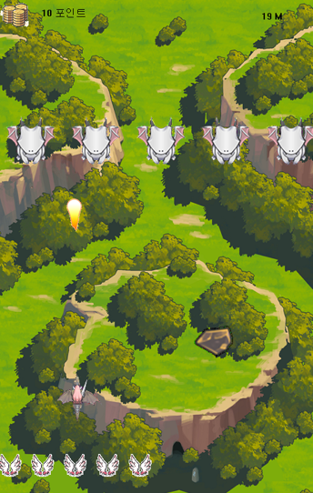
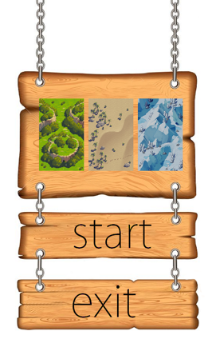
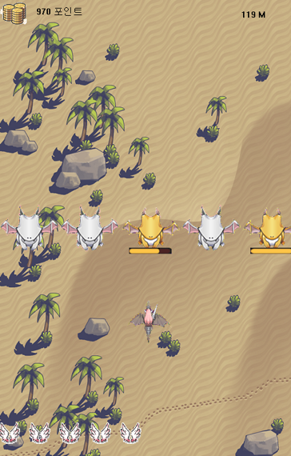
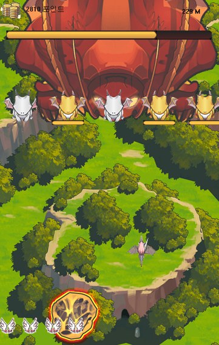
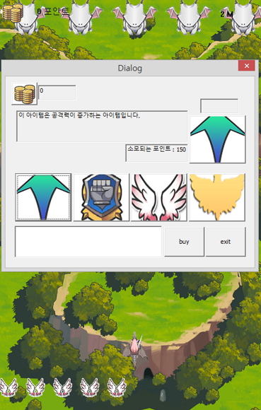
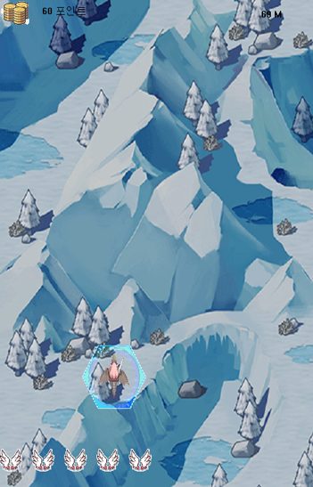
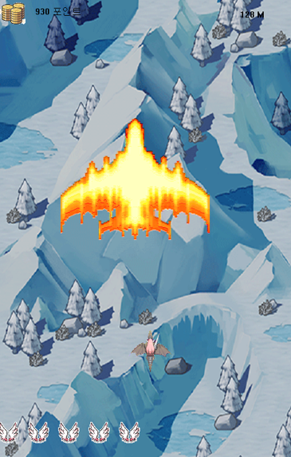

# Dragon Flight
> 2016-1 '윈도우프로그래밍' 강의를 들으며 진행한 게임 개발 프로젝트 입니다.

'드래곤 플라이트'를 모티브로 한 게임
* winAPI
* game development

## 게임 플레이

1. Title
* 3가지 맵을 선택할 수 있다.

2. In Game
* 기본 몬스터와 중급 몬스터, 보스가 존재하고 플레이어는 미사일을 날려 몬스터를 공격할 수 있다.
* 몬스터가 날린 운석에 맞거나 몬스터와 충돌할 시 플레이어는 목숨을 하나 잃게 된다.

2-1. Store
* 몬스터를 공격해 포인트를 얻을 수 있고 이 얻은 포인트로 상점에서 아이템을 구매할 수 있다.
* 구매할 아이템들을 선택하면 필요한 포인트가 뜨고 현재 포인트가 이를 만족한다면 아이템이 구매된다.

